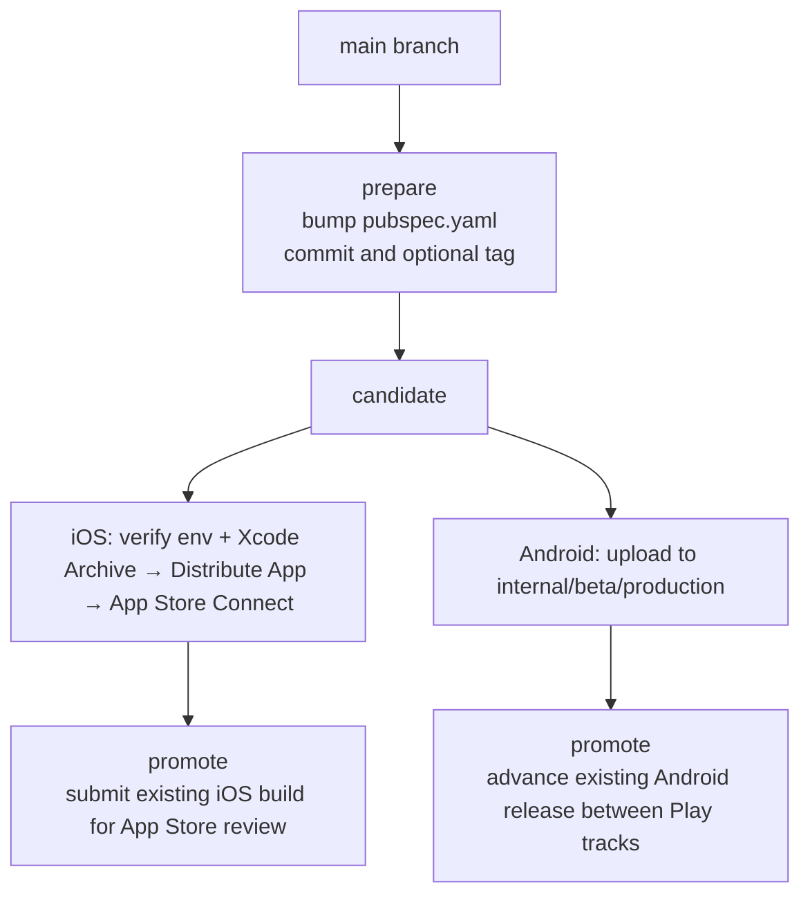

# Moustra Mobile Deployment Guide

This guide describes the supported release flow for Moustra mobile.

## Release Model

The release process is split into three actions:

1. `prepare`
   - Bumps the version in `pubspec.yaml`
   - Commits the bump on `main`
   - Optionally tags the release commit
2. `candidate`
   - **iOS:** Verifies `.env.production` and reminds you to archive and upload from Xcode (see **iOS: Xcode** below). Running `./scripts/deploy.sh candidate --platform ios` runs tests (unless skipped) and prints the checklist; it does not produce an IPA.
   - **Android:** Builds the app from the current working tree using the version in `pubspec.yaml` and uploads to the selected Google Play track
3. `promote`
   - Reuses an existing uploaded build
   - Submits iOS for App Store review (Fastlane from `ios/`)
   - Promotes Android between Play tracks without rebuilding

This is simpler than the previous flow because deployment no longer creates `release/*` branches or mutates git state while uploading to the stores.



## Entry Points

### Unified Script

Run all release actions from the project root:

```bash
./scripts/deploy.sh prepare --bump patch --push --tag
./scripts/deploy.sh candidate --platform both --android-track internal
./scripts/deploy.sh promote --platform both --android-to production --ios-build 47
```

For **iOS-only** candidate (tests + env check + Xcode reminder):

```bash
./scripts/deploy.sh candidate --platform ios
```

### Platform Scripts

Use Android-only scripts when you only need Play uploads:

```bash
./scripts/deploy-android.sh candidate --track internal
./scripts/deploy-android.sh promote --to production
```

## Version Management

The app version is stored in `pubspec.yaml`:

```yaml
version: 1.0.23+47
```

- `1.0.23` is the marketing version.
- `47` is the build number.

`./scripts/deploy.sh prepare` always reads the current version from a clean checkout of `main`, increments the build number, and commits only `pubspec.yaml`.

### Prepare Options

```bash
./scripts/deploy.sh prepare --bump build|patch|minor|major [--push] [--tag] [--skip-tests]
./scripts/deploy.sh prepare --version x.y.z [--push] [--tag] [--skip-tests]
```

Examples:

```bash
# 1.0.23+47 -> 1.0.24+48
./scripts/deploy.sh prepare --bump patch --push --tag

# 1.0.23+47 -> 1.0.23+48
./scripts/deploy.sh prepare --bump build --push --tag

# 1.0.23+47 -> 2.0.0+48
./scripts/deploy.sh prepare --version 2.0.0 --push --tag
```

## Candidate Uploads

### iOS: Xcode

Ship iOS with a single flow in Xcode after `prepare` has set the version in `pubspec.yaml`.

**Why run Flutter from the terminal first:** Release builds must compile with `ENV_FILENAME=.env.production` so the app loads production config. The default Dart compile uses `.env`. Run this once before archiving:

```bash
flutter build ios --release --dart-define=ENV_FILENAME=.env.production --no-codesign
```

Then:

1. **Product → Archive** — builds and signs the app.
2. In the **Organizer** window, click **Distribute App**.
3. Follow the assistant; Xcode uploads the build to **App Store Connect** (TestFlight / App Store).
4. Done — one flow, all in Xcode.

Open the workspace (not the bare project):

```bash
open ios/Runner.xcworkspace
```

**Optional:** If you prefer not to use Organizer, you can export an IPA and upload with **Transporter** (Mac App Store).

**Automation helper:** `./scripts/deploy.sh candidate --platform ios` (or `--platform both`) runs `flutter test` (unless `--skip-tests`), verifies `.env.production`, and prints this checklist. It does not invoke Xcode for you.

### Android

```bash
./scripts/deploy.sh candidate --platform android --android-track internal
```

Supported Android upload tracks:

- `internal`
- `beta`
- `production`

This will:

1. Verify `.env.production`
2. Build the AAB
3. Verify the AAB includes `.env.production`
4. Upload the AAB to the selected Play track

### Both Platforms

```bash
./scripts/deploy.sh candidate --platform both --android-track internal
```

By default, `candidate` runs `flutter test` first. Use `--skip-tests` only when CI has already validated the commit.

## Promotions

Promotions do not rebuild the app and do not bump the version.

### iOS

```bash
./scripts/deploy.sh promote --platform ios --ios-build 47
```

If `--ios-build` is omitted, Fastlane uses the build number from `pubspec.yaml`.

You can also submit the uploaded build for review from [App Store Connect](https://appstoreconnect.apple.com).

### Android

```bash
./scripts/deploy.sh promote --platform android --android-to beta
./scripts/deploy.sh promote --platform android --android-to production
```

- `beta` promotes `internal -> beta`
- `production` promotes `beta -> production`

### Both Platforms

```bash
./scripts/deploy.sh promote --platform both --android-to production --ios-build 47
```

## Local Prerequisites

### iOS

- Xcode with command line tools
- Apple Developer account access
- Valid signing configuration on the machine (team, certificates, provisioning)

### Android

- Android SDK
- `android/android-secret.json`
- `android/key.properties`
- `android/upload-keystore.jks`

### Ruby / Fastlane

```bash
cd ios && bundle install
cd android && bundle install
```

Fastlane is used for **iOS promote** (submit for review) and **Android** candidate/promote flows.

## Troubleshooting

### Dirty Working Tree

`prepare` refuses to run if git has tracked or untracked changes. `candidate` and `promote` do not require a clean tree.

### iOS Version Rejected

If App Store Connect says the version train is closed or the version must be higher, run a new `prepare` with `patch`, `minor`, or `major` instead of another build-only bump.

### iOS Upload Fails From Xcode

Use a stable network; retry **Distribute App** from Organizer. If Xcode’s upload keeps failing, export the IPA and use **Transporter**, or check [Apple System Status](https://developer.apple.com/system-status/).

### Android Uploaded The Wrong Artifact

The Android candidate script now deletes any previous release AAB before building, so stale artifacts are not reused.

## Metadata

- iOS metadata: `ios/fastlane/metadata/`
- Android metadata: `android/fastlane/metadata/`
