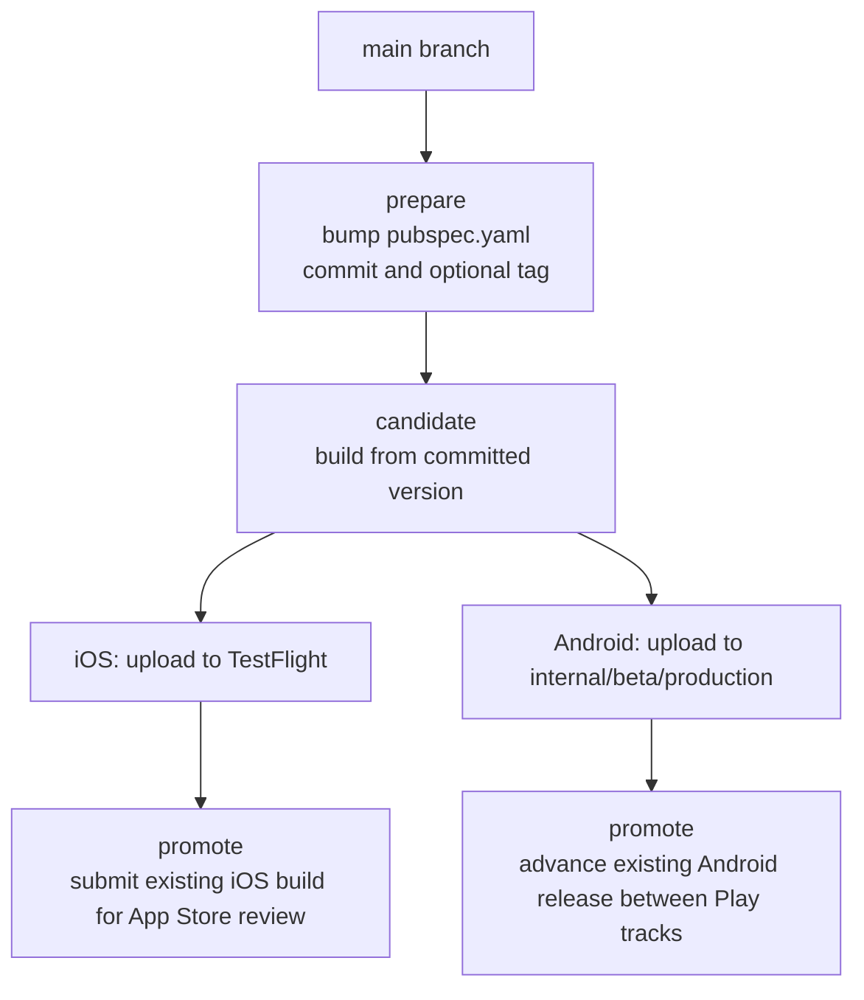

# Moustra Mobile Deployment Guide

This guide describes the supported release flow for Moustra mobile.

## Release Model

The release process is split into three actions:

1. `prepare`
   - Bumps the version in `pubspec.yaml`
   - Commits the bump on `main`
   - Optionally tags the release commit
2. `candidate`
   - Builds the app from the version already committed in git
   - Uploads iOS to TestFlight
   - Uploads Android to the selected Google Play track
3. `promote`
   - Reuses an existing uploaded build
   - Submits iOS for App Store review
   - Promotes Android between Play tracks without rebuilding

This is simpler than the previous flow because deployment no longer creates `release/*` branches or mutates git state while uploading to the stores.



## Entry Points

### Unified Script

Run all release actions from the project root:

```bash
./scripts/deploy.sh prepare --bump patch --push --tag
./scripts/deploy.sh candidate --platform both --android-track internal
./scripts/deploy.sh promote --platform both --android-to production --ios-build 47
```

### Platform Scripts

Use these when you only need one platform:

```bash
./scripts/deploy-ios.sh candidate
./scripts/deploy-ios.sh promote --build 47

./scripts/deploy-android.sh candidate --track internal
./scripts/deploy-android.sh promote --to production
```

## Version Management

The app version is stored in `pubspec.yaml`:

```yaml
version: 1.0.23+47
```

- `1.0.23` is the marketing version.
- `47` is the build number.

`./scripts/deploy.sh prepare` always reads the current version from a clean checkout of `main`, increments the build number, and commits only `pubspec.yaml`.

### Prepare Options

```bash
./scripts/deploy.sh prepare --bump build|patch|minor|major [--push] [--tag] [--skip-tests]
./scripts/deploy.sh prepare --version x.y.z [--push] [--tag] [--skip-tests]
```

Examples:

```bash
# 1.0.23+47 -> 1.0.24+48
./scripts/deploy.sh prepare --bump patch --push --tag

# 1.0.23+47 -> 1.0.23+48
./scripts/deploy.sh prepare --bump build --push --tag

# 1.0.23+47 -> 2.0.0+48
./scripts/deploy.sh prepare --version 2.0.0 --push --tag
```

## Candidate Uploads

Candidate uploads build from the version already committed in git.

### iOS

```bash
./scripts/deploy.sh candidate --platform ios
```

This will:

1. Verify `.env.production`
2. Build Flutter iOS in release mode
3. Archive the IPA with Fastlane
4. Upload the IPA to TestFlight

### Android

```bash
./scripts/deploy.sh candidate --platform android --android-track internal
```

Supported Android upload tracks:

- `internal`
- `beta`
- `production`

This will:

1. Verify `.env.production`
2. Build the AAB
3. Verify the AAB includes `.env.production`
4. Upload the AAB to the selected Play track

### Both Platforms

```bash
./scripts/deploy.sh candidate --platform both --android-track internal
```

By default, `candidate` runs `flutter test` first. Use `--skip-tests` only when CI has already validated the commit.

## Promotions

Promotions do not rebuild the app and do not bump the version.

### iOS

```bash
./scripts/deploy.sh promote --platform ios --ios-build 47
```

If `--ios-build` is omitted, Fastlane uses the build number from `pubspec.yaml`.

### Android

```bash
./scripts/deploy.sh promote --platform android --android-to beta
./scripts/deploy.sh promote --platform android --android-to production
```

- `beta` promotes `internal -> beta`
- `production` promotes `beta -> production`

### Both Platforms

```bash
./scripts/deploy.sh promote --platform both --android-to production --ios-build 47
```

## GitHub Actions

Manual release automation is available in:

`/.github/workflows/deploy.yml`

The workflow supports:

- `prepare_release`
- `upload_candidate`
- `promote_release`

### Workflow Inputs

- `action`: release action to run
- `platform`: `ios`, `android`, or `both`
- `version_bump`: used by `prepare_release`
- `version_override`: explicit marketing version for `prepare_release`
- `android_track`: upload track for Android candidate builds
- `android_promote_to`: promotion target for Android
- `ios_build`: existing iOS build number for promotion

## GitHub Secrets

Add these in **Settings > Secrets and variables > Actions**.

### Required For All Release Actions

- `ENV_PRODUCTION`

### Required For iOS Candidate / Promote

- `APPSTORE_API_PRIVATE_KEY`

The workflow writes this to:

`ios/fastlane/keys/AuthKey_HG69G96CXV.p8`

### Required For Android Candidate / Promote

- `PLAY_STORE_SERVICE_ACCOUNT_JSON`
- `ANDROID_KEYSTORE_BASE64`
- `ANDROID_KEY_ALIAS`
- `ANDROID_KEY_PASSWORD`
- `ANDROID_STORE_PASSWORD`

## CI Notes

- `prepare_release` is safe on GitHub-hosted runners because it only updates git state.
- Android candidate and promotion are fully wired for CI via secrets.
- iOS candidate and promotion also require a runner with valid signing configuration for the Xcode archive step. If you do not have that on GitHub-hosted runners yet, use the same script flow locally on a configured Mac.

## Local Prerequisites

### iOS

- Xcode with command line tools
- Apple Developer account access
- Valid signing configuration on the machine

### Android

- Android SDK
- `android/android-secret.json`
- `android/key.properties`
- `android/upload-keystore.jks`

### Ruby / Fastlane

```bash
cd ios && bundle install
cd android && bundle install
```

## Troubleshooting

### Dirty Working Tree

Release scripts refuse to run if git has tracked or untracked changes. Clean the tree first.

### iOS Version Rejected

If App Store Connect says the version train is closed or the version must be higher, run a new `prepare` with `patch`, `minor`, or `major` instead of another build-only bump.

### iOS Upload Is Slow Or Fails

The upload script retries Fastlane uploads and falls back to `xcrun altool`. Network instability to Apple’s CDN is the common cause.

### Android Uploaded The Wrong Artifact

The Android candidate script now deletes any previous release AAB before building, so stale artifacts are not reused.

## Metadata

- iOS metadata: `ios/fastlane/metadata/`
- Android metadata: `android/fastlane/metadata/`
